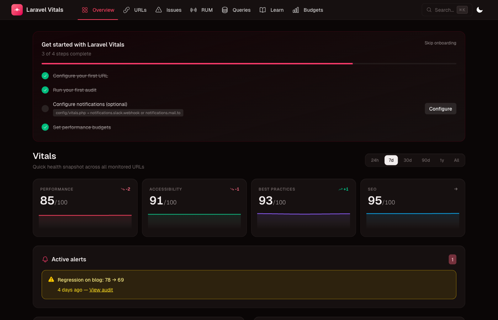
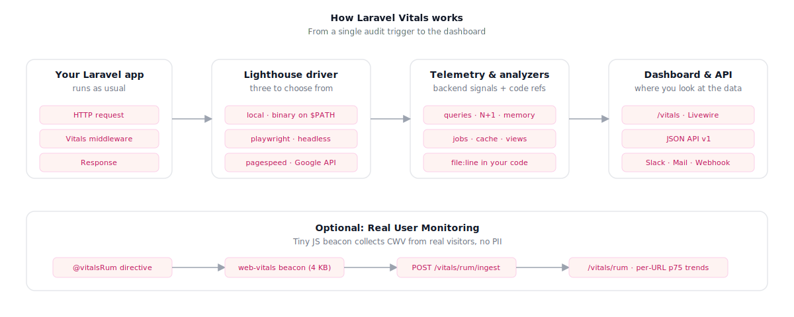
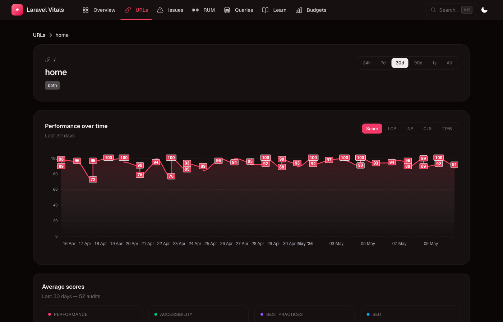
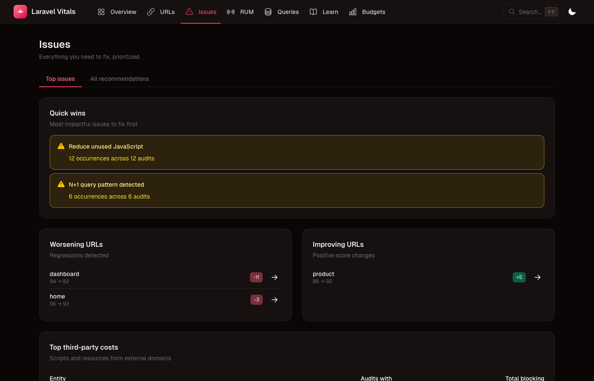
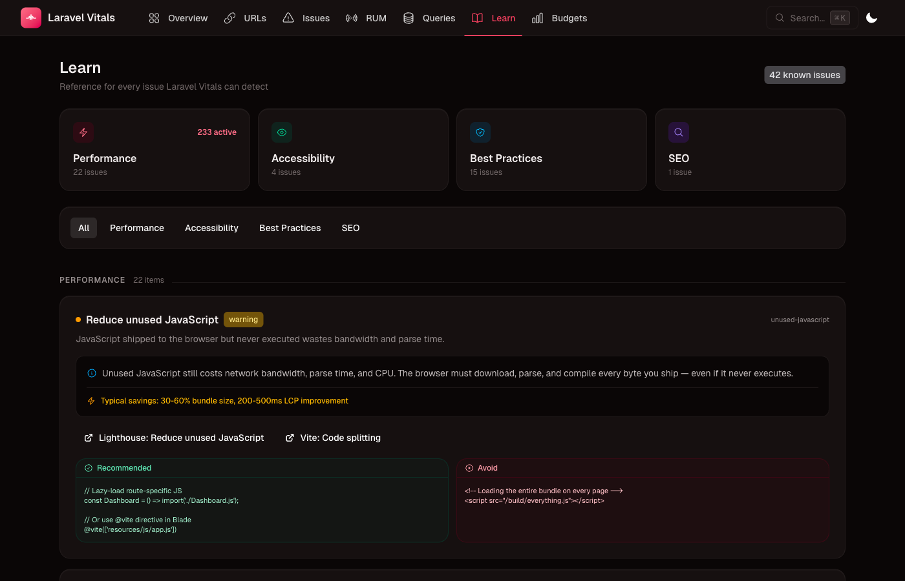

<p align="center">
  
</p>

[](https://github.com/corentinbtmps/laravel-vitals/actions/workflows/ci.yml)
[](https://packagist.org/packages/humantocomputer/laravel-vitals)
[](LICENSE.md)

# Laravel Vitals

**Performance auditing, Real User Monitoring, and actionable recommendations — all inside your Laravel app.**

<p align="center">
  
  <br/>
  <em>Overview dashboard — lens cards with sparklines, onboarding progress, active alerts</em>
</p>

---

## Table of contents

- [What is Laravel Vitals](#what-is-laravel-vitals)
- [Why Laravel Vitals](#why-laravel-vitals)
- [Requirements](#requirements)
- [Installation](#installation)
- [Quick start](#quick-start)
- [Architecture](#architecture)
- [Features](#features)
  - [Lighthouse audits — three drivers](#lighthouse-audits--three-drivers)
  - [Backend telemetry](#backend-telemetry)
  - [Source code references](#source-code-references)
  - [Real User Monitoring](#real-user-monitoring)
  - [Database query baselines](#database-query-baselines)
  - [Performance budgets](#performance-budgets)
  - [Dashboard](#dashboard)
  - [Issues page](#issues-page)
  - [Learn knowledge base](#learn-knowledge-base)
  - [JSON API](#json-api)
  - [CI integration](#ci-integration)
  - [Slack notifications](#slack-notifications)
  - [Public endpoints](#public-endpoints)
  - [Boost and Claude Code integration](#boost-and-claude-code-integration)
- [Configuration](#configuration)
- [Artisan commands](#artisan-commands)
- [Privacy](#privacy)
- [Performance impact](#performance-impact)
- [Troubleshooting](#troubleshooting)
- [Contributing](#contributing)
- [License](#license)

---

## What is Laravel Vitals

Laravel Vitals runs Google Lighthouse against your own pages, captures what your server was doing at that exact moment — queries, memory, N+1 problems — and points directly at the lines of code responsible. Everything lands in a dashboard at `/vitals` that any team member can read and act on. Real User Monitoring is opt-in with one Blade directive. Your data stays in your own database — no SaaS, no per-seat billing.

---

## Why Laravel Vitals

| Capability | GTMetrix / PageSpeed | Laravel Vitals |
|---|---|---|
| Lighthouse scores (Performance, Accessibility, SEO, Best Practices) | ✓ | **✓** |
| Backend telemetry — queries, memory, N+1, cache | ✗ | **✓** |
| Source code references — exact file and line in your app | ✗ | **✓** |
| Real User Monitoring — self-hosted, no PII | paid / ✗ | **✓** |
| Performance budgets with CI exit codes | ✗ | **✓** |
| GitHub PR auto-comments with score table | ✗ | **✓** |
| Self-hosted — your data stays yours | ✗ | **✓** |

---

## Requirements

- PHP 8.2 or higher
- Laravel 11, 12, or 13
- Livewire 4 and Flux Free 2 (installed automatically by Composer)
- **Local driver:** Node 18+ and `npm install -g lighthouse`
- **Playwright driver:** Node 18+ and `npm install playwright playwright-lighthouse` in your project
- **PageSpeed driver:** a free [Google PageSpeed Insights API key](https://developers.google.com/speed/docs/insights/v5/get-started)

The `auto` driver (default) tries `local` → `playwright` → `pagespeed` in order. If your server has Node and the lighthouse CLI, no extra setup is needed.

---

## Installation

```bash
composer require humantocomputer/laravel-vitals
php artisan vendor:publish --tag=vitals-config
php artisan migrate
php artisan vitals:install
```

Add `@vitalsRum` to your main layout's `<head>` to enable Real User Monitoring:

```blade
<head>
    <meta charset="utf-8">
    @vitalsRum
</head>
```

Verify the setup:

```bash
php artisan vitals:doctor
```

---

## Quick start

Declare a URL in `config/vitals.php`:

```php
'urls' => ['home' => '/'],
```

Run your first audit:

```bash
php artisan vitals:audit home --sync
```

Visit `/vitals`.

That's it. You now have a Lighthouse score, backend telemetry, and a list of recommendations with file/line references in your own source code.

---

## Architecture

<p align="center">
  
</p>

1. **Declare URLs** in `config/vitals.php` as `'label' => '/path'` pairs. Run `vitals:audit` manually, on a schedule, or from CI.
2. **Audit starts.** The package signs an `X-Vitals-Audit-Id` header with your `APP_KEY` and spawns Lighthouse (local Node, Playwright, or Google PageSpeed API depending on your driver).
3. **Backend telemetry.** While Lighthouse navigates the page, your own middleware detects the signed header and records: query count, total query time, N+1 suspicion, peak memory, views rendered, jobs dispatched, and cache hits/misses.
4. **Lighthouse result.** Scores arrive (0–100) alongside raw metric values: LCP, INP, CLS, TTFB, FCP, TBT, Speed Index.
5. **Code analysis.** Static analyzers scan your Blade views, Vite config, and `composer.json` to attach exact file:line references to each Lighthouse finding. Everything is stored and surfaced at `/vitals`. If a budget threshold is exceeded or a regression is detected, a Slack message or email fires automatically.

---

## Features

### Lighthouse audits — three drivers

Lighthouse simulates a page load under realistic mobile conditions and scores Performance, Accessibility, Best Practices, and SEO from 0 to 100.

| Driver | Requires | Best for |
|---|---|---|
| `local` | Node 18+ + `lighthouse` CLI | Dev machines and CI with Node |
| `playwright` | Node 18+ + `playwright` + `playwright-lighthouse` | Docker-based CI |
| `pagespeed` | Google API key (`VITALS_PAGESPEED_API_KEY`) | Public URLs, no Node needed |
| `auto` | Falls back through the above | Default — works in most environments |

The `local` and `playwright` drivers work behind authentication. The `pagespeed` driver requires a publicly reachable URL and cannot capture backend telemetry.

```bash
php artisan vitals:audit home --driver=local --device=mobile
php artisan vitals:audit --all --sync   # all URLs, synchronous (CI-friendly)
```

---

### Backend telemetry

When Lighthouse loads a page, the package captures a server-side snapshot: query count, total query time, unique queries, N+1 suspect flag (triggered when queries_count / queries_unique ≥ 10), peak memory, views rendered, jobs dispatched, cache hits/misses, and any slow queries that exceed the configured threshold (default: 50ms).

When N+1 queries are detected, the package also stores up to 200 normalized SQL patterns per request with the exact PHP file and line that triggered each query (skipping vendor and package frames to always point at your own code). The audit detail and issue detail pages surface the top 3 repeated patterns with occurrence counts and caller locations.

This answers questions that Lighthouse alone cannot: "Why is our LCP slow — is it the database?" or "Which exact line in my controller is causing 42 repeated queries?"

By default, telemetry is only captured during audit runs — zero overhead for real visitors. Set `telemetry.always_capture = true` to sample a configurable percentage of all requests (default 5%), similar to how Laravel Pulse works.

---

### Source code references

This is the key differentiator. When Lighthouse flags "render-blocking resources" or "unused JavaScript", the package shows you the exact file and line in your codebase that caused it.

```
Recommendation: Eliminate render-blocking resources
Source: resources/views/layouts/app.blade.php  line 12
  <link rel="stylesheet" href="/css/bootstrap.min.css">
  Hint: Use @vite([...]) to bundle and version this asset, or add defer/async.
```

Seven analyzers scan your project: Blade asset tags, image tags, Laravel config settings (missing `config:cache`, debug mode in production), Composer packages, Vite config, Blade view patterns, and `.env` settings.

---

### Real User Monitoring

Add `@vitalsRum` to your layout's `<head>` to collect Core Web Vitals (LCP, INP, CLS, TTFB, FCP) from real visitors. Beacons are sent via `sendBeacon` after page load — no impact on performance. Results appear at `/vitals/rum`.

**Privacy by design:** no IP addresses, no cookies, no session identifiers. Only metric values, URL path, device type, connection hint, and user-agent are stored. See [Privacy](#privacy) for the full list.

---

### Database query baselines

The `/vitals/queries` page answers a question most teams cannot: "Did this recent deployment slow down the database on route X?"

For each route with telemetry data you get average, p75, and p95 query count and query time. Routes are compared to the previous equivalent period — if you are looking at 7 days, it compares to the 7 days before that. A route is flagged with a regression badge when its current p75 query count is more than double what it was in the baseline period. The page also surfaces the top 5 routes by p75 peak memory — useful for catching routes that spike to 256 MB on 25% of requests before they cause production incidents.

---

### Performance budgets

Set limits on any metric. When an audit exceeds a limit, an alert fires.

```php
// config/vitals.php
'budgets' => [
    'lcp_ms'            => ['warning' => 2500, 'critical' => 4000],
    'score_performance' => ['warning' => 90,   'critical' => 70],
    // ... per_url overrides available
],
```

Use `--fail-on-budget` in CI to get non-zero exit codes (1 = warning, 2 = critical):

```bash
php artisan vitals:audit --all --sync --fail-on-budget --format=junit > results.xml
```

---

### Dashboard

A Livewire application at `/vitals` — no asset compilation required in your app.

<p align="center">
  
  <br/>
  <em>URL detail — area chart with daily scores, metric toggle, and period selector</em>
</p>

Seven top-level pages: Overview · URLs · Issues · RUM · Queries · Learn · Budgets. A built-in Cmd+K spotlight searches across URLs, audits, and recommendations anywhere in the dashboard.

**Access control:** available in `local` by default. To allow access in production, define the `viewVitals` gate:

```php
use LaravelVitals\Facades\Vitals;

Vitals::authorize(fn ($user) => $user?->is_admin ?? false);
```

---

### Issues page

<p align="center">
  
  <br/>
  <em>Issues — Quick Wins, Worsening URLs, Improving URLs, third-party costs</em>
</p>

`/vitals/issues` has two tabs. **Top issues** shows cross-URL quick wins, URLs that are currently worsening or improving, and third-party script cost breakdowns. **All recommendations** aggregates every recommendation across all audits, sorted by frequency — making it easy to find the one fix that would improve the most pages at once.

Each recommendation row links to `/vitals/issues/{audit_key}` — a deep view that shows every occurrence grouped by URL, with the exact file and line where the issue originates in your code. For N+1 queries, this page lists the top 3 repeated SQL patterns with occurrence counts and caller location.

Each recommendation includes severity (info / warning / critical), category (Performance, Accessibility, Best Practices, SEO), the source code reference (file + line), a one-sentence fix hint, and links to the relevant web.dev article and Laravel documentation. The package covers Lighthouse findings, Laravel-specific issues (missing `config:cache`, debug mode in production, sync queue, disabled OPcache), and backend signals (N+1 queries with SQL attribution, slow queries, large payloads).

---

### Learn knowledge base

<p align="center">
  
  <br/>
  <em>Learn — ~42 issue types explained with web.dev / Laravel doc links and code samples</em>
</p>

`/vitals/learn` is a browsable knowledge base of approximately 42 known issue types, grouped by category. Each entry covers what causes the finding, its impact, and how to fix it — with links to web.dev and the relevant Laravel documentation.

---

### JSON API

A read-only JSON API at `/vitals/api/v1`, protected by the same `viewVitals` gate. No separate API tokens required — the session cookie is sufficient for CI scripts making authenticated requests. Intended for custom dashboards, CI scripts, and third-party integrations.

| Endpoint | Returns |
|---|---|
| `GET /vitals/api/v1/audits` | Paginated audit list |
| `GET /vitals/api/v1/audits/{id}` | Single audit with scores, metrics, recommendations |
| `GET /vitals/api/v1/urls` | All configured URLs |
| `GET /vitals/api/v1/urls/{id}/latest` | Most recent audit for one URL |
| `GET /vitals/api/v1/recommendations` | All stored recommendations |

Query parameters: `?page=N&per_page=M` (default 25, max 100), `?since=YYYY-MM-DD&until=YYYY-MM-DD`.

```bash
curl -s https://yourapp.com/vitals/api/v1/urls/1/latest \
  -H "Accept: application/json"
```

---

### CI integration

**GitHub Action** — audits your preview deployment and posts a score comparison table as a PR comment. Your team sees the performance impact before merging, without running any manual checks.

```yaml
# .github/workflows/pr-perf.yml
- uses: humantocomputer/laravel-vitals/.github/actions/vitals-pr-comment@v1.0.0
  with:
    preview-url: ${{ vars.PREVIEW_URL }}
    base-url: https://your-production-app.com
    github-token: ${{ secrets.GITHUB_TOKEN }}
    fail-on-regression: 'true'  # exit 1 when score drops > regression-threshold
```

Available inputs: `preview-url` (required), `base-url`, `github-token` (required), `fail-on-regression` (default false), `regression-threshold` (default 5 points), `devices` (default `mobile`; accepts `mobile,desktop`).

**Pre-commit hook** — runs `vitals:doctor` before every `git commit` and blocks the commit if any check fails (missing migration, broken asset, mis-configured notification):

```bash
php artisan vitals:install-hook             # install (or --type=pre-push for push hook)
php artisan vitals:install-hook --uninstall # remove (restores previous hook from backup)
```

---

### Slack notifications

Set `VITALS_NOTIFICATIONS_SLACK_WEBHOOK` in `.env`. Each completed audit that triggers an alert posts a message to your channel. Budget violations and regression alerts are posted as replies in the same thread — the Slack message timestamp is stored so follow-ups always find the right thread.

```env
VITALS_NOTIFICATIONS_SLACK_WEBHOOK=https://hooks.slack.com/services/...
VITALS_NOTIFICATIONS_MAIL_TO=team@yourcompany.com
```

Notification triggers: `budget_violation` (on by default), `regression` (on, 10% threshold), `weekly_digest` (on), `audit_completed` (off — too noisy for most teams). Supported channels: `mail`, `slack`, `database`.

Add these to your scheduler:

```php
Schedule::command('vitals:digest:send')->weekly();
Schedule::command('vitals:check-regressions')->daily();
```

---

### Public endpoints

**Health check** — `GET /vitals/health` returns database status, driver availability, queue status, and telemetry buffer state. HTTP 200 = all checks pass; 503 = something failed. No auth required — suitable for Uptime Robot and similar monitors.

**Status page** — `GET /vitals/status` is an opt-in public page showing uptime %, Core Web Vitals distribution, and recent incidents. Enable it in `config/vitals.php`:

```php
'status' => ['enabled' => true, 'title' => 'My App Status'],
```

**Self-monitoring** — `vitals:self-check` reports Vitals table sizes and the 10 slowest telemetry captures. Schedule it hourly to catch overhead early.

---

### Boost and Claude Code integration

`php artisan vitals:install` writes two context files into your project:

- `.ai/guidelines/vitals.blade.php` — used by Laravel Boost and compatible AI tools
- `.claude/skills/laravel-vitals/SKILL.md` — used by Claude Code (Anthropic's CLI)

These help AI coding assistants generate correct code when you ask them to add recommendations or RUM metrics. Re-publish after updating the package with `php artisan vitals:boost:install --force`.

---

## Configuration

Full annotated source: `config/vitals.php`. The most useful keys:

| Key | Default | What it controls |
|---|---|---|
| `driver` | `auto` | Lighthouse driver. `auto` tries local → playwright → pagespeed. |
| `urls` | `[]` | Monitored URLs as `['label' => '/path']`. |
| `telemetry.always_capture` | `false` | Set `true` to sample all requests, not just audits. |
| `telemetry.slow_query_threshold_ms` | `50` | Queries slower than this are stored individually. |
| `budgets.*` | see config | Warning/critical thresholds per metric. `per_url` allows per-URL overrides. |
| `rum.sample_rate` | `1.0` | Fraction of page loads that send a RUM beacon (0.05–0.1 for high-traffic). |
| `notifications.channels` | `['mail']` | Add `'slack'` or `'database'` as needed. |
| `ui.editor_url_template` | `null` | Set to `vscode://file/{file}:{line}` to make source references clickable. |
| `status.enabled` | `false` | Opt-in public status page at `/vitals/status`. |
| `retention.days` | `90` | Audit and RUM retention. RUM has its own `rum.retention_days` (also 90 days). |

The UI is available in English, French, German, and Spanish — follows `app()->getLocale()`.

---

## Artisan commands

| Command | What it does |
|---|---|
| `vitals:audit {label}` | Audit one URL |
| `vitals:audit --all` | Audit all URLs (queued batch) |
| `vitals:audit --all --sync` | Audit all URLs synchronously |
| `vitals:demo` | Seed fictional data for exploration |
| `vitals:doctor` | Run diagnostic checks |
| `vitals:install` | Publish Boost and Claude Code skill files |
| `vitals:install-hook` | Install a git pre-commit hook |
| `vitals:discover --routes` | List candidate URLs from your routes |
| `vitals:discover --sitemap=URL` | List candidate URLs from a sitemap |
| `vitals:check-regressions` | Compare latest audits to the 7-day baseline |
| `vitals:digest:send` | Send a weekly summary |
| `vitals:purge --demo` | Remove demo data |
| `vitals:purge` | Remove all Vitals data (confirmation required) |
| `vitals:boost:install` | Re-publish Boost / Claude skill files |
| `vitals:boost:diff` | Check if installed AI files differ from package |
| `vitals:self-check` | Check table sizes and slow telemetry captures |

**Key `vitals:audit` options:**

| Option | Description |
|---|---|
| `--device=mobile\|desktop` | Device profile (default: mobile) |
| `--driver=local\|playwright\|pagespeed` | Override configured driver |
| `--sync` | Run synchronously instead of queuing |
| `--fail-on-budget` | Exit 1 (warning) or 2 (critical) on budget violations |
| `--format=table\|json\|junit` | Output format |

---

## Privacy

**What RUM collects:** metric name and value, rating (good/needs-improvement/poor), URL path, device type, connection hint, navigation type, user-agent string.

**What RUM does NOT collect:** IP addresses, cookies, session identifiers, user IDs, geolocation, or any fingerprint.

Backend telemetry records server-side performance metrics, not user behavior. It is only stored during audit runs unless `telemetry.always_capture` is enabled.

**Retention:** audits and RUM events default to 90 days. Configure via `retention.days` and `rum.retention_days`. Schedule `model:prune` daily to apply it:

```php
$schedule->command('model:prune', ['--model' => [
    \LaravelVitals\Models\Audit::class,
    \LaravelVitals\Models\Recommendation::class,
    \LaravelVitals\Models\BackendTelemetry::class,
    \LaravelVitals\Models\RumEvent::class,
]])->daily();
```

Because no PII is collected in RUM beacons, this data typically does not require GDPR consent mechanisms. Consult your legal team for your jurisdiction.

---

## Performance impact

**Middleware:** `CaptureVitalsTelemetry` returns immediately on every request that does not carry the `X-Vitals-Audit-Id` header. The fast-path overhead is sub-microsecond.

**RUM script:** ~4.25 kB gzipped, loaded with `defer`, sends beacons only after full page load via `sendBeacon`.

**Dashboard assets:** served by dedicated package routes with long-lived cache headers. Never loaded for non-dashboard routes.

---

## Troubleshooting

**1. "URL [home] not found in config or database"**
Declare it in `config/vitals.php` first: `'urls' => ['home' => '/']`, then re-run the audit.

**2. Lighthouse fails with a Chrome error in Docker / Linux**
Add `--no-sandbox` to `chrome_flags`:
```php
'drivers' => ['local' => ['chrome_flags' => ['--headless', '--no-sandbox']]],
```

**3. Dashboard shows "Access Denied"**
Define the `viewVitals` gate in `AppServiceProvider`:
```php
Vitals::authorize(fn ($user) => $user?->is_admin ?? false);
```

**4. RUM data not appearing**
Verify `@vitalsRum` is in `<head>` and `VITALS_RUM_ENABLED=true` is set. Check the browser network tab for a POST to `/vitals/rum/ingest`.

**5. `vitals:doctor` shows failing checks**
Read the output — each line includes a remediation hint. Common fixes: `php artisan migrate` (unpublished migrations), `Add VITALS_NOTIFICATIONS_MAIL_TO` (mail notifications configured without a recipient).

---

## Contributing

See [CONTRIBUTING.md](CONTRIBUTING.md) for setup instructions, code conventions, and how to add a new recommendation or RUM metric.

---

## License

Laravel Vitals is open-source software released under the [MIT license](LICENSE.md).

Built with: [Livewire](https://livewire.laravel.com), [Flux](https://fluxui.dev), [Google Lighthouse](https://developer.chrome.com/docs/lighthouse/overview/), [web-vitals](https://github.com/GoogleChrome/web-vitals), [spatie/laravel-searchable](https://github.com/spatie/laravel-searchable), [spatie/laravel-onboard](https://github.com/spatie/laravel-onboard).
